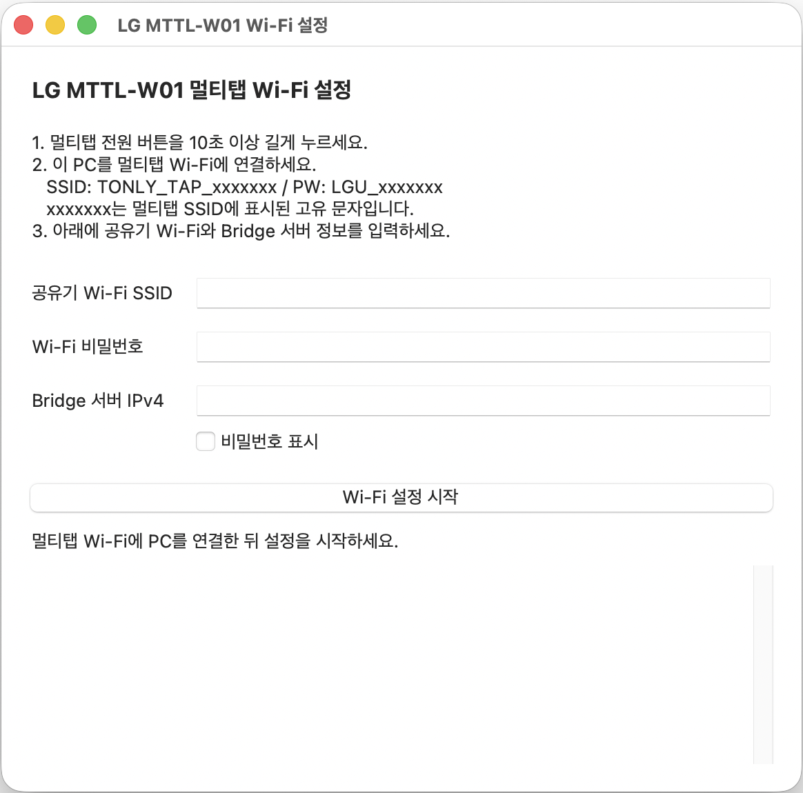
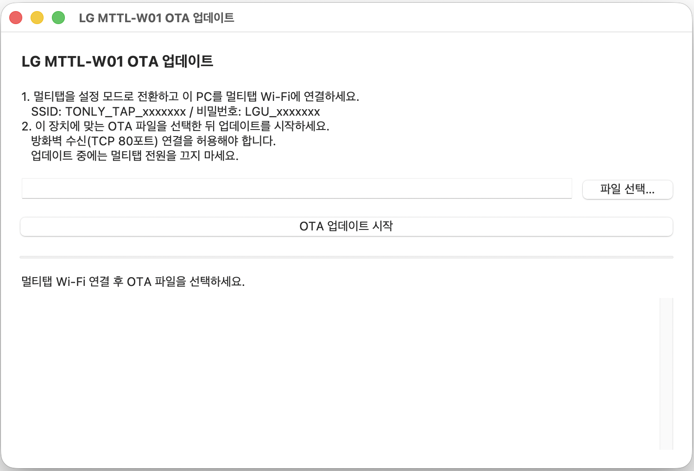

# MTTL-W01 MatterBridge

[한국어](README.md) | English

A local Matter bridge for the LG MTTL-W01 four-outlet smart power strip. Use it with platforms such as SmartThings or control it through a web dashboard.

- Works with stock firmware, without changing your router’s DNAT or DNS settings.
- Communicates directly using the device’s internal TCP protocol instead of MQTT. With stock firmware, it polls device status every 10 seconds by default.
- For immediate status updates, use custom firmware. See the Korean Naver communities “HomeAssistant” and “모두의 스마트홈” for details.
- Control each outlet and view its current power consumption and cumulative energy usage.

Set up the bridge in this order: **Start the bridge → Configure the power strip’s Wi-Fi → Add it to your Matter app**. Keep the bridge server running while you use the power strip.

## 1. What you need

- An LG MTTL-W01 power strip
- A Linux server, such as a Raspberry Pi, or a Linux-based NAS running Docker
- A Windows or macOS PC to configure the power strip’s Wi-Fi
- A Matter-compatible app, such as SmartThings, Apple Home, or Google Home, and any hub or controller required by that platform

Connect the server, power strip, and Matter controller to the same local network behind your router.

Install Docker Engine and the Compose plugin on the server. Follow the [Docker installation guide](https://docs.docker.com/engine/install/) for your operating system. Then check that these commands work in a terminal:

```bash
docker version
docker compose version
```

## 2. Run the bridge with Docker

Create a folder on the server to store your configuration:

```bash
mkdir mttl-bridge
cd mttl-bridge

nano docker-compose.yml
# Paste the configuration below, then press Ctrl+O to save.
```

Save the following configuration as `docker-compose.yml` in this folder. This configuration runs the Docker Hub image, unlike the local-build Compose file included in the repository.

```yaml
services:
  mttl-bridge:
    image: ttaengz/mttl-w01-matterbridge:latest
    network_mode: host
    restart: unless-stopped
    stop_grace_period: 30s
    environment:
      HTTP_PORT: 8086
      MATTER_PORT: 5540
      MTTL_POLL_INTERVAL_MS: 10000
      MTTL_RESPONSE_TIMEOUT_MS: 3000
    volumes:
      - ./devices:/app/data
      - ./matter:/root/.matter
```

Run the following command from the same folder:

```bash
docker compose up -d

# To stop the server:
# docker compose down
```

Open `http://{SERVER_IP}:8086` in your browser, replacing `{SERVER_IP}` with your server’s IP address. Once the dashboard appears, the server is ready.

To change the server ports:

- If another Matter service is already running on the same server, change `MATTER_PORT`, for example to `MATTER_PORT: 5541`.
- To change the web dashboard port, set `HTTP_PORT`, for example to `HTTP_PORT: 8080`, and open `http://{SERVER_IP}:8080`.

## 3. Configure the power strip’s Wi-Fi and server address

Download the Wi-Fi setup tool for your PC. On macOS, extract the ZIP file and launch the app.

- [Windows Wi-Fi setup tool (x64)](tools/setup_wifi_gui_windows.exe)
- [macOS Wi-Fi setup tool (Apple silicon)](tools/setup_wifi_gui_macos.zip)



1. Press and hold the power strip’s power button for **at least 10 seconds** to enter setup mode.
2. Connect your PC to `TONLY_TAP_xxxxxxx` in the Wi-Fi list. The password is `LGU_xxxxxxx`; replace `xxxxxxx` with the same characters shown in the Wi-Fi name. It is normal for this network to have no internet access.
3. Open the Wi-Fi setup tool and enter your **router’s Wi-Fi SSID** (`공유기 Wi-Fi SSID`), **Wi-Fi password** (`Wi-Fi 비밀번호`), and **bridge server IPv4 address** (`Bridge 서버 IPv4`). Enter only the IP address, such as `192.168.1.100`, without `http://` or `:8086`.
4. Click **Start Wi-Fi setup** (`Wi-Fi 설정 시작`) and wait for the tool’s completion message.
5. Reconnect your PC to its usual Wi-Fi network and open the bridge dashboard.

Once the power strip connects, it will appear in the dashboard’s device list shortly afterward.

## 4. Add the bridge to your Matter app

1. Open the bridge dashboard and find the QR code in the **Matter connection** (`Matter 연결`) section.
2. In your Matter app, choose to add a device and scan the QR code.
3. Follow the app’s instructions to complete registration.

## Firmware updates

The bridge works with stock firmware. If you want to install custom firmware, you can use the OTA tool below. You must obtain the firmware file separately.

- [Windows OTA tool (x64)](tools/ota_gui_windows.exe)
- [macOS OTA tool (Apple silicon)](tools/ota_gui_macos.zip)


